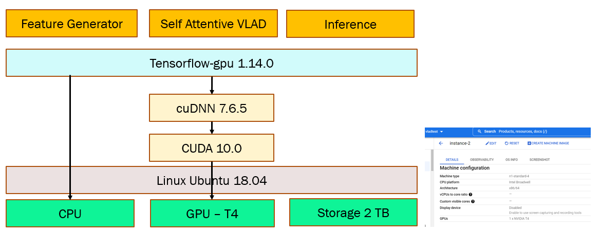

This project is forked from our capstone project, 
repo : https://github.com/JishaMansoor/NetVlad_Attention

#Video Understanding : Automatic Tagging of videos through self attentive learnable key descriptors

This code is forked from Willow Project and change are made on top of it

This code is on top of Tensor flow 1.14.0.

Hardware requirement: Each model have been run on a single NVIDIA T4 16GB GPU. Batch size 80 was giving Out of memory and we have to work with Batch size of 32 for the full dataset run

Please note that because of the time constraint, we did not have time to try to run the code from scratch.
It might be possible, but rather unlikely, that something is not working properly. If so please create an issue on
github.

## Training the single models in your Local system:
Training is done using 1/10th of train dataset. The partial dataaset is downloaded through following commands

  curl data.yt8m.org/download.py | shard=1,10 partition=2/frame/train mirror=us python

Evaluation is done using 1/100th of the validataion dataset. The partial dataset is downloaded through following commands

  curl data.yt8m.org/download.py | shard=1,100 partition=2/frame/validate mirror=us python
  
Following command line can train the model. They are scheduled to stop training at the good time. The best result with small dataset is obtained with below configurations

train.py --train_data_pattern=<train/dataset/path/>train*.tfrecord --model=NetVLADAttnModel --train_dir=Attention_Early --frame_features=True --feature_names="rgb,audio" --feature_sizes="1024,128" --batch_size=80 --base_learning_rate=0.0002 --netvlad_cluster_size=256 --netvlad_hidden_size=1024 --moe_l2=1e-6 --iterations=300 --learning_rate_decay=0.8 --netvlad_relu=False --gating=True --moe_prob_gating=True --early_attention=True --shift_operation=True --late_attention=False --very_early_attention=False --dropout_rate=0.01 --add_batch_norm_attn=True --numofheads=1 --num_epochs=10 --max_steps=4000 --export_model_steps=1000

## Training the data set in Google Data platform

For training with full data set we used a google cloud platform Ubuntu 18.04 instance with 1 GPU (NVIDIA-T4) support and 2 TB memory storage. Ubuntu 20.04 was not supporting GPU-T4 with Tensorflow 1.14 version. So downgraded the OS to support the CUDA,cuDNN ,and GPU to support for Tensorflow 1.14.0. 

Following is the command for downloading the full dataset

Our Best model is is providing an evaluation result of 82.36% . 

curl data.yt8m.org/download.py | partition=2/frame/train mirror=us python

curl data.yt8m.org/download.py | partition=2/frame/validate mirror=us python

curl data.yt8m.org/download.py | partition=2/frame/test mirror=us python

The Best training configuration model with full data is with following :

python train.py --train_data_pattern=<train/dataset/path/>train*.tfrecord --model=NetVLADAttnModel --train_dir=Attention_Early --frame_features=True --feature_names="rgb,audio" --feature_sizes="1024,128" --batch_size=32 --base_learning_rate=0.0002 --netvlad_cluster_size=256 --netvlad_hidden_size=1024 --moe_l2=1e-6 --iterations=300 --learning_rate_decay=0.8 --netvlad_relu=False --gating=False --moe_prob_gating=True --early_attention=True --shift_operation=False --late_attention=False --very_early_attention=False --dropout_rate=0.01 --add_batch_norm_attn=False --numofheads=1  --max_steps=175000 --export_model_steps=10000

For evaluation:
python eval.py --train_data_pattern=<validation/dataset/path/>valid*.tfrecord --model=NetVLADAttnModel --train_dir=Attention_Early --frame_features=True --feature_names="rgb,audio" --feature_sizes="1024,128" --batch_size=32 --base_learning_rate=0.0002 --netvlad_cluster_size=256 --netvlad_hidden_size=1024 --moe_l2=1e-6 --iterations=300 --learning_rate_decay=0.8 --netvlad_relu=False --gating=False --moe_prob_gating=True --early_attention=True --shift_operation=False --late_attention=False --very_early_attention=False --dropout_rate=0.01 --add_batch_norm_attn=False --numofheads=1  --max_steps=175000 --export_model_steps=10000 --run_once=True 

Each model takes several hours (around 16 hours) to train

## Inference

Following command can be run for inference:
python inference.py --output_file=test_attention_early_vlad.csv --input_data_pattern=<test/dataset/path/>test*.tfrecord" --model=NetVLADAttnModel --train_dir=Attention_Early --frame_features=True --feature_names="rgb,audio" --feature_sizes="1024,128" --batch_size=32 --base_learning_rate=0.0002 --netvlad_cluster_size=256 --netvlad_hidden_size=1024 --moe_l2=1e-6 --iterations=300 --learning_rate_decay=0.8 --netvlad_relu=False --gating=False --moe_prob_gating=True --early_attention=True --shift_operation=False --late_attention=False --very_early_attention=False --dropout_rate=0.01 --add_batch_norm_attn=False --numofheads=1  --max_steps=175000 --export_model_steps=10000 --run_once=True --top_k=20

